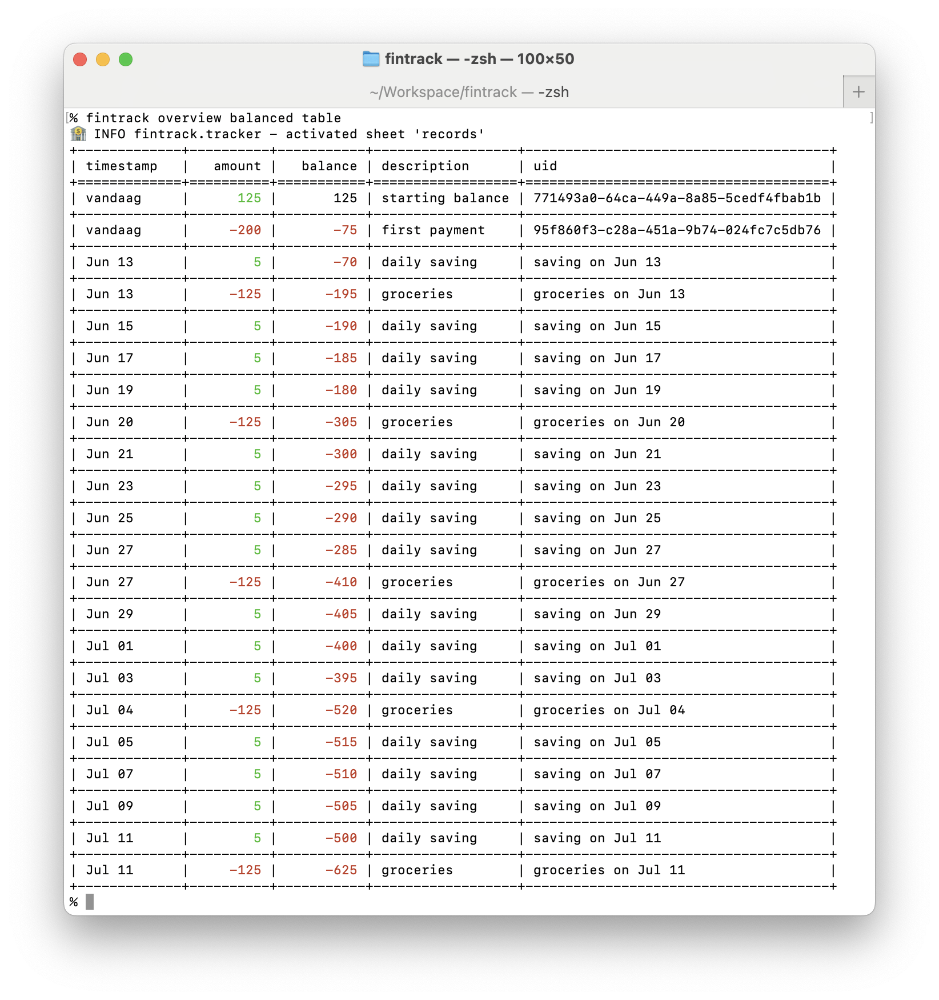

# Getting Started

FinTrack allows you to record financial transactions (income & expenses), both actuals as planned. It has the notion of sheets to group related records.

## Install

FinTrack is hosted on PyPI...

```console
$ pip install fintrack
```

## Basic Usage

FinTrack kan be used as a console/command line tool or as a Python module

### Console

```console
% export DATE_ORDER=DMY
% export DATE_LANG=nl_NL
% LOG_LEVEL=DEBUG fintrack version
🏦 DEBUG fintrack.util - using a date order DMY
🏦 DEBUG fintrack.util - using date language nl_NL
🏦 DEBUG fintrack.tracker - using /Users/xtof/.fintrack
🏦 WARNING fintrack.tracker - /Users/xtof/.fintrack doesn't contain config.yaml
🏦 INFO fintrack.tracker - activated sheet 'records'
0.0.1

% date
Wed Jun 11 10:25:41 CEST 2025

% fintrack add 125 "starting balance" today
🏦 WARNING fintrack.tracker - /Users/xtof/.fintrack doesn't contain config.yaml
🏦 INFO fintrack.tracker - activated sheet 'records'
🏦 INFO fintrack.tracker - added record for 125 vandaag starting balance

% fintrack table
🏦 INFO fintrack.tracker - activated sheet 'records'
+-------------+----------+------------------+--------------------------------------+
| timestamp   |   amount | description      | uid                                  |
+=============+==========+==================+======================================+
| vandaag     |      125 | starting balance | 771493a0-64ca-449a-8a85-5cedf4fbab1b |
+-------------+----------+------------------+--------------------------------------+

% cat ~/.fintrack/records.json
[
  {
    "amount": "125",
    "description": "starting balance",
    "timestamp": "2025-06-11T10:27:44.518314",
    "uid": "771493a0-64ca-449a-8a85-5cedf4fbab1b"
  }
] 
```

### Python Module

```python
>>> import json
>>> from fintrack.tracker import Tracker
>>> from fintrack.utils import ClassEncoder
>>> tracker = Tracker()
>>> tracker.version
'0.0.1'
>>> tracker.add(-200, "first payment")
>>> print(json.dumps(list(tracker), cls=ClassEncoder, indent=2))
[
  {
    "amount": "125",
    "description": "starting balance",
    "timestamp": "2025-06-11T10:27:44.518314",
    "uid": "771493a0-64ca-449a-8a85-5cedf4fbab1b"
  },
  {
    "amount": "-200",
    "description": "first payment",
    "timestamp": "2025-06-11T10:30:22.320676",
    "uid": "95f860f3-c28a-451a-9b74-024fc7c5db76"
  }
]
>>> print(tracker.balanced.table)
+-------------+----------+-----------+------------------+--------------------------------------+
| timestamp   |   amount |   balance | description      | uid                                  |
+=============+==========+===========+==================+======================================+
| vandaag     |      125 |       125 | starting balance | 771493a0-64ca-449a-8a85-5cedf4fbab1b |
+-------------+----------+-----------+------------------+--------------------------------------+
| vandaag     |     -200 |       -75 | first payment    | 95f860f3-c28a-451a-9b74-024fc7c5db76 |
+-------------+----------+-----------+------------------+--------------------------------------+
```

## Planning

FinTrack also allows you to make plans using PlannedRecords:

```console
% fintrack sheet plans add 5 "daily saving" "every other day" "saving on {date}"
🏦 WARNING fintrack.tracker - could not find sheet plans.json
🏦 INFO fintrack.tracker - activated sheet 'records'
🏦 INFO fintrack.tracker - activated sheet 'plans'
🏦 INFO fintrack.tracker - added plan for 5 every other day daily saving
% fintrack sheet plans add -125 "groceries" "every friday" "groceries on {date}"
🏦 INFO fintrack.tracker - activated sheet 'records'
🏦 INFO fintrack.tracker - activated sheet 'plans'
🏦 INFO fintrack.tracker - added plan for -125 every friday groceries
% fintrack sheet plans table
🏦 INFO fintrack.tracker - activated sheet 'records'
🏦 INFO fintrack.tracker - activated sheet 'plans'
+-----------------+----------+---------------+---------------------+--------------------------------------+
| schedule        |   amount | description   | uids                | uid                                  |
+=================+==========+===============+=====================+======================================+
| every other day |        5 | daily saving  | saving on {date}    | a3b11e8b-6df7-4371-845a-68ce3a0a01c6 |
+-----------------+----------+---------------+---------------------+--------------------------------------+
| every friday    |     -125 | groceries     | groceries on {date} | 9e60cfac-3f3a-4983-a09f-348530d633cc |
+-----------------+----------+---------------+---------------------+--------------------------------------+
% fintrack future "next month" table
🏦 INFO fintrack.tracker - activated sheet 'records'
+-------------+----------+---------------+---------------------+
| timestamp   |   amount | description   | uid                 |
+=============+==========+===============+=====================+
| Jun 13      |        5 | daily saving  | saving on Jun 13    |
+-------------+----------+---------------+---------------------+
| Jun 13      |     -125 | groceries     | groceries on Jun 13 |
+-------------+----------+---------------+---------------------+
| Jun 15      |        5 | daily saving  | saving on Jun 15    |
+-------------+----------+---------------+---------------------+
| Jun 17      |        5 | daily saving  | saving on Jun 17    |
+-------------+----------+---------------+---------------------+
| Jun 19      |        5 | daily saving  | saving on Jun 19    |
+-------------+----------+---------------+---------------------+
| Jun 20      |     -125 | groceries     | groceries on Jun 20 |
+-------------+----------+---------------+---------------------+
| Jun 21      |        5 | daily saving  | saving on Jun 21    |
+-------------+----------+---------------+---------------------+
| Jun 23      |        5 | daily saving  | saving on Jun 23    |
+-------------+----------+---------------+---------------------+
| Jun 25      |        5 | daily saving  | saving on Jun 25    |
+-------------+----------+---------------+---------------------+
| Jun 27      |        5 | daily saving  | saving on Jun 27    |
+-------------+----------+---------------+---------------------+
| Jun 27      |     -125 | groceries     | groceries on Jun 27 |
+-------------+----------+---------------+---------------------+
| Jun 29      |        5 | daily saving  | saving on Jun 29    |
+-------------+----------+---------------+---------------------+
| Jul 01      |        5 | daily saving  | saving on Jul 01    |
+-------------+----------+---------------+---------------------+
| Jul 03      |        5 | daily saving  | saving on Jul 03    |
+-------------+----------+---------------+---------------------+
| Jul 04      |     -125 | groceries     | groceries on Jul 04 |
+-------------+----------+---------------+---------------------+
| Jul 05      |        5 | daily saving  | saving on Jul 05    |
+-------------+----------+---------------+---------------------+
| Jul 07      |        5 | daily saving  | saving on Jul 07    |
+-------------+----------+---------------+---------------------+
| Jul 09      |        5 | daily saving  | saving on Jul 09    |
+-------------+----------+---------------+---------------------+
| Jul 11      |        5 | daily saving  | saving on Jul 11    |
+-------------+----------+---------------+---------------------+
| Jul 11      |     -125 | groceries     | groceries on Jul 11 |
+-------------+----------+---------------+---------------------+
```

Records can be "balanced" and the "overview" shows recent and future expected transactions:

```console
% fintrack overview balanced table
🏦 INFO fintrack.tracker - activated sheet 'records'
+-------------+----------+-----------+------------------+--------------------------------------+
| timestamp   |   amount |   balance | description      | uid                                  |
+=============+==========+===========+==================+======================================+
| vandaag     |      125 |       125 | starting balance | 771493a0-64ca-449a-8a85-5cedf4fbab1b |
+-------------+----------+-----------+------------------+--------------------------------------+
| vandaag     |     -200 |       -75 | first payment    | 95f860f3-c28a-451a-9b74-024fc7c5db76 |
+-------------+----------+-----------+------------------+--------------------------------------+
| Jun 13      |        5 |       -70 | daily saving     | saving on Jun 13                     |
+-------------+----------+-----------+------------------+--------------------------------------+
| Jun 13      |     -125 |      -195 | groceries        | groceries on Jun 13                  |
+-------------+----------+-----------+------------------+--------------------------------------+
| Jun 15      |        5 |      -190 | daily saving     | saving on Jun 15                     |
+-------------+----------+-----------+------------------+--------------------------------------+
| Jun 17      |        5 |      -185 | daily saving     | saving on Jun 17                     |
+-------------+----------+-----------+------------------+--------------------------------------+
| Jun 19      |        5 |      -180 | daily saving     | saving on Jun 19                     |
+-------------+----------+-----------+------------------+--------------------------------------+
| Jun 20      |     -125 |      -305 | groceries        | groceries on Jun 20                  |
+-------------+----------+-----------+------------------+--------------------------------------+
| Jun 21      |        5 |      -300 | daily saving     | saving on Jun 21                     |
+-------------+----------+-----------+------------------+--------------------------------------+
| Jun 23      |        5 |      -295 | daily saving     | saving on Jun 23                     |
+-------------+----------+-----------+------------------+--------------------------------------+
| Jun 25      |        5 |      -290 | daily saving     | saving on Jun 25                     |
+-------------+----------+-----------+------------------+--------------------------------------+
| Jun 27      |        5 |      -285 | daily saving     | saving on Jun 27                     |
+-------------+----------+-----------+------------------+--------------------------------------+
| Jun 27      |     -125 |      -410 | groceries        | groceries on Jun 27                  |
+-------------+----------+-----------+------------------+--------------------------------------+
| Jun 29      |        5 |      -405 | daily saving     | saving on Jun 29                     |
+-------------+----------+-----------+------------------+--------------------------------------+
| Jul 01      |        5 |      -400 | daily saving     | saving on Jul 01                     |
+-------------+----------+-----------+------------------+--------------------------------------+
| Jul 03      |        5 |      -395 | daily saving     | saving on Jul 03                     |
+-------------+----------+-----------+------------------+--------------------------------------+
| Jul 04      |     -125 |      -520 | groceries        | groceries on Jul 04                  |
+-------------+----------+-----------+------------------+--------------------------------------+
| Jul 05      |        5 |      -515 | daily saving     | saving on Jul 05                     |
+-------------+----------+-----------+------------------+--------------------------------------+
| Jul 07      |        5 |      -510 | daily saving     | saving on Jul 07                     |
+-------------+----------+-----------+------------------+--------------------------------------+
| Jul 09      |        5 |      -505 | daily saving     | saving on Jul 09                     |
+-------------+----------+-----------+------------------+--------------------------------------+
| Jul 11      |        5 |      -500 | daily saving     | saving on Jul 11                     |
+-------------+----------+-----------+------------------+--------------------------------------+
| Jul 11      |     -125 |      -625 | groceries        | groceries on Jul 11                  |
+-------------+----------+-----------+------------------+--------------------------------------+
```

GitHub's console-markdown doesn't allow me to show this off, so here's an old school screenshot of that last command:


